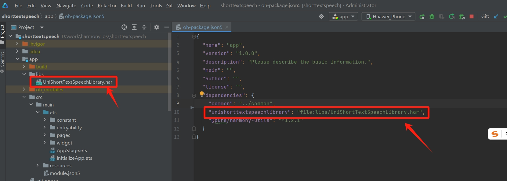

## 短文本语音合成SDK介绍

unishorttextspeechlibrary SDK基于HarmonyOS开发的短文本语音合成SDK，将短文本（ ≤ 500 字符）转换成自然流畅的语音，可流式播放，支持多种音色，并提供调节音量、语速、音高、亮度等功能。适用于智能客服、语音交互、导航播报等场景。

**SDK包名**：unishorttextspeechlibrary

**SDK版本号** ： 1.0.0

**约束与限制**

在下述版本通过验证：

| DevEco Studio版本号        | HarmonyOS SDK版本号                   | 手机操作系统ROM版本号               |
|:------------------------|:-----------------------------------|:---------------------------|
| DevEco Studio 5.0.3.100 | 【API12】HarmonyOS SDK 5.0.0.13(SP4) | 3.0.0.13(SP6DEVC00E13R6P1) |

## SDK集成说明

### 一、集成方式
将SDK的har包拷贝到工程的libs目录下：

工程结构图如下：




* 在oh-package.json5文件，关联加载短文本语音合成库

```
"dependencies":
  {
    "unishorttextspeechlibrary": "file:libs/UniShortTextSpeechLibrary.har",
  }
```

* 在module.json5文件，添加网络权限


### 二、使用说明

#### 初始化SDK

```
 SpeechSdk.init(SDKParams.APP_KEY, SDKParams.APP_SECRET)

```

配置参数：appKey（必填）、appSecret（必填）

#### 设置语音合成参数

```
@State speechParams: SpeechParams = {
    format: "pcm",
    vcn: "kiyo-plus",
    text: "",
    sample: 16000,
    speed: 50,
    volume: 50,
    pitch: 50,
    bright: 50
  }
SpeechEngine.getInstance().setSpeechParams(this.speechParams)
```

#### 短文本合成语音

```
  SpeechEngine.getInstance().playSpeech(this.speechParams.text)
```

#### 短文本语音合成监听

```
SpeechEngine.getInstance().setSpeechCallback({
      onInitializationComplete: (): void => {

      },
      onSpeechStart: (): void => {

      },
      onSpeechEnd: (): void => {

      },
      onError: (code: number, message: string): void => {

      },
      onStatus: (status: string): void => {

      },
      onSpeechResultData: (value: string | ArrayBuffer): void => {

      }
    })
```

### 三、TTS标签

<table><tr><th>类别</th> <th>标签</th> <th>标注作用</th> <th>文本标注</th> <th>播报效果</th></tr> <tr><td rowspan="3">数字类</td> <td> &lt;value&gt; </td> <td>使数字串按照数值的方式发音</td> <td>这是第&lt;value&gt;110&lt;/value&gt;会议室</td> <td>这是第一百一十会议室</td></tr> <tr><td> &lt;code&gt; </td> <td>使数字串按照编码的方式发音("1"读作"一")</td> <td>这是第&lt;code&gt;110&lt;/code&gt;会议室</td> <td>这是一一零会议室</td></tr> <tr><td> &lt;tel&gt; </td> <td>使数字串按照电话号码的方式发音("1"读作"幺")</td> <td>会议室分机号为&lt;value&gt;110&lt;/value&gt;</td> <td>会议室分机号为幺幺零</td></tr> <tr><td rowspan="2">注音类</td> <td> &lt;py&gt; </td> <td>使引擎按照指定的读音播报汉字</td> <td>搜索结果为&lt;py&gt;wei2&lt;/py&gt;空&lt;py&gt;kong1&lt;/py&gt;会议室</td> <td>搜索结果为(wei2)空(kong1)</td></tr> <tr><td> &lt;pname&gt; </td> <td>使引擎以正确播报姓名中的多音字姓氏文本标注</td> <td>播放&lt;pname&gt;单田芳&lt;/pname&gt;的评书</td> <td>播放单(shan4)田芳的评书</td></tr> <tr><td rowspan="2">断句类</td> <td> &lt;word&gt; </td> <td>根据标注的方式进行断词,用于解决分词错误的问题,如:(乒乓球)(拍卖)(完了);(乒乓)(球拍)(卖完了)</td> <td>&lt;word&gt;乒乓&lt;/word&gt;&lt;word&gt;球拍&lt;/word&gt;&lt;word&gt;卖完了&lt;/word&gt;</td> <td>（乒乓）（球拍）（卖完了）</td></tr> <tr><td> &lt;phrase&gt; </td> <td>根据标注的方式进行短语停顿（比断词的停顿时间更长），用于解决短语停顿错误的问题。如：（爸爸亲了我妈妈）（也亲了我）；（爸爸亲了我）（妈妈也亲了我）文本标注</td> <td>&lt;phrase&gt;爸爸亲了我&lt;/phrase&gt;&lt;phrase&gt;妈妈也亲了我&lt;/phrase&gt;</td> <td>（爸爸亲了我）（妈妈也亲了我）</td></tr> <tr><td>英文类</td> <td> &lt;letter&gt; </td> <td>将标注的英文单词按照逐个字母的方式进行播报文本标注</td> <td>世界卫生组织的英文缩写&lt;letter&gt;WHO&lt;/letter&gt;</td> <td>世界卫生组织的英文缩写是（W）（H）（O）</td></tr> <tr><td rowspan="2">其他</td> <td> &lt;mute&gt; </td> <td>在句中手动添加适当长度的停顿</td> <td>请您再说一遍&lt;mute&gt;300&lt;/mute&gt;或说取消</td> <td>请您再说一遍(停顿300ms)或说取消</td></tr> <tr><td> &lt;sub&gt; </td> <td>将标注的文本使用别名中的内容替换后进行播报</td> <td>气压的测量单位是&lt;sub alias="毫米汞柱"&gt;mmHg&lt;/mute&gt;或说取消</td> <td>气压的测量单位是毫米汞柱</td></tr></table>

### 四、错误码
<table><thead><tr><th style="text-align: left;">错误码</th><th style="text-align: left;">说明</th><th style="text-align: left;">解决方法</th></tr></thead><tbody><tr><td style="text-align: left;">0</td><td style="text-align: left;">正确</td><td style="text-align: left;"></td></tr><tr><td style="text-align: left;">401</td><td style="text-align: left;">签名校验失败</td><td style="text-align: left;">客户端检查参数参数是否正确</td></tr><tr><td style="text-align: left;">403</td><td style="text-align: left;">时钟偏移校验失败</td><td style="text-align: left;">客户端检查时间参数参数是否正确</td></tr><tr><td style="text-align: left;">10001</td><td style="text-align: left;">appKey为空</td><td style="text-align: left;">客户端检查Appkey参数是否正确</td></tr><tr><td style="text-align: left;">10002</td><td style="text-align: left;">appSecret 为空</td><td style="text-align: left;">客户端检查AppSecret参数是否正确</td></tr><tr><td style="text-align: left;">10003</td><td style="text-align: left;">基础地址为空</td><td style="text-align: left;">客户端检查参数是否正确</td></tr><tr><td style="text-align: left;">10004</td><td style="text-align: left;">音频下载地址为空</td><td style="text-align: left;">客户端检查下载地址是否正确</td></tr><tr><td style="text-align: left;">10005</td><td style="text-align: left;">文本为空</td><td style="text-align: left;">客户端检查合成文本是否正确</td></tr><tr><td style="text-align: left;">10101</td><td style="text-align: left;">文本超过限制长度</td><td style="text-align: left;">文本长度控制500字以内</td></tr><tr><td style="text-align: left;">10201</td><td style="text-align: left;">连接错误</td><td style="text-align: left;">重新连接或者检查网络</td></tr><tr><td style="text-align: left;">20301</td><td style="text-align: left;">参数错误</td><td style="text-align: left;">客户端检查参数是否正确</td></tr><tr><td style="text-align: left;">20302</td><td style="text-align: left;">发音人不可用</td><td style="text-align: left;">到控制台查看可用发音人</td></tr><tr><td style="text-align: left;">20303</td><td style="text-align: left;">服务内部错误</td><td style="text-align: left;">建议重试，或者提工单，工单详情请提供sid</td></tr><tr><td style="text-align: left;">20304</td><td style="text-align: left;">并发超过限制</td><td style="text-align: left;">减小并发或者购买并发套餐</td></tr><tr><td style="text-align: left;">20305</td><td style="text-align: left;">套餐次数使用完</td><td style="text-align: left;">购买次数套餐</td></tr><tr><td style="text-align: left;">20306</td><td style="text-align: left;">appKey不存在</td><td style="text-align: left;">检查appkey是否合法</td></tr><tr><td style="text-align: left;">20307</td><td style="text-align: left;">客户端ip不在白名单中</td><td style="text-align: left;">检查是否开启白名单，同时检查客户端出口ip是否在ip白名单中	</td></tr></tbody></table>


### 五、发音人列表

<table><tr><th>音库类型</th> <th>发音人名称</th> <th>发音人风格</th> <th>发音人代码</th> <th>发音人描述</th></tr> <tr><td rowspan="73">精品音库</td> <td rowspan="7">橙橙</td> <td>默认</td> <td>chengcheng-neutral-plus</td> <td rowspan="7">知性大方</td></tr> <tr><td>开心</td> <td>chengcheng-happy-plus</td></tr> <tr><td>生气</td> <td>chengcheng-angry-plus</td></tr> <tr><td>厌恶</td> <td>chengcheng-disgust-plus</td></tr> <tr><td>害怕</td> <td>chengcheng-fear-plus</td></tr> <tr><td>难过</td> <td>chengcheng-sad-plus</td></tr> <tr><td>吃惊</td> <td>chengcheng-amazed-plus</td></tr> <tr><td rowspan="7">莎莎</td> <td>默认</td> <td>shasha-neutral-plus</td> <td rowspan="7">亲和自然</td></tr> <tr><td>开心</td> <td>shasha-happy-plus</td></tr> <tr><td>生气</td> <td>shasha-angry-plus</td></tr> <tr><td>厌恶</td> <td>shasha-disgust-plus</td></tr> <tr><td>害怕</td> <td>shasha-fear-plus</td></tr> <tr><td>难过</td> <td>shasha-sad-plus</td></tr> <tr><td>惊喜</td> <td>shasha-surprise-plus</td></tr> <tr><td rowspan="2">晓迪</td> <td>默认</td> <td>xiaodi-plus</td> <td rowspan="2">温柔舒缓</td></tr> <tr><td>温暖</td> <td>xiaodi-warm-plus</td></tr> <tr><td rowspan="2">Kiyo</td> <td>元气</td> <td>kiyo-plus</td> <td rowspan="2">可爱女生</td></tr> <tr><td>职业</td> <td>suren-plus</td></tr> <tr><td rowspan="2">萱萱</td> <td>默认</td> <td>xuanxuan-plus</td> <td rowspan="2">甜美女生</td></tr> <tr><td>端庄</td> <td>xuanxuan-dignified-plus</td></tr> <tr><td>晓琴</td> <td>默认</td> <td>xiaoqin-plus</td> <td>亲切温和</td></tr> <tr><td>Jenny</td> <td>默认</td> <td>jenny-plus</td> <td>纯正美音</td></tr> <tr><td rowspan="2">小峰</td> <td>默认</td> <td>xiaofeng-plus</td> <td rowspan="2">男播音员</td></tr> <tr><td>庄重</td> <td>xiaofeng-solemn-plus</td></tr> <tr><td rowspan="2">小雯</td> <td>默认</td> <td>xiaowen-plus</td> <td rowspan="2">女播音员</td></tr> <tr><td>庄重</td> <td>xiaowen-solemn-plus</td></tr> <tr><td>天天</td> <td>默认</td> <td>tiantian-plus</td> <td>天真男孩</td></tr> <tr><td>糖糖</td> <td>默认</td> <td>tangtang-plus</td> <td>活泼女孩</td></tr> <tr><td>珍妮</td> <td>默认</td> <td>zhenni-plus</td> <td>异域风情</td></tr> <tr><td>玲玲</td> <td>默认</td> <td>lingling-plus</td> <td>台湾女生</td></tr> <tr><td>晓珂</td> <td>默认</td> <td>xiaoke-plus</td> <td>漂亮御姐</td></tr> <tr><td>宁宁</td> <td>默认</td> <td>ningning-plus</td> <td>粤语女声</td></tr> <tr><td rowspan="4">冰冰</td> <td>默认</td> <td>bingbing-duihua-plus</td> <td rowspan="4">明亮利落</td></tr> <tr><td>客服</td> <td>bingbing-kefu-plus</td></tr> <tr><td>消极</td> <td>bingbing-neg-plus</td></tr> <tr><td>积极</td> <td>bingbing-pos-plus</td></tr> <tr><td>贝儿</td> <td>默认</td> <td>beier-plus</td> <td>元气少女</td></tr> <tr><td rowspan="9">惠惠</td> <td>默认</td> <td>huihui-normal-plus</td> <td rowspan="9">成熟大方</td></tr> <tr><td>中立</td> <td>huihui-neutral-plus</td></tr> <tr><td>生气</td> <td>huihui-angry-plus</td></tr> <tr><td>害怕</td> <td>huihui-fear-plus</td></tr> <tr><td>开心</td> <td>huihui-happy-plus</td></tr> <tr><td>难过</td> <td>huihui-sad-plus</td></tr> <tr><td>惊喜</td> <td>huihui-surprise-plus</td></tr> <tr><td>讽刺</td> <td>huihui-sarcastic-plus</td></tr> <tr><td>可疑</td> <td>huihui-suspicious-plus</td></tr> <tr><td rowspan="9">晨阳</td> <td>默认</td> <td>chenyang-normal-plus</td> <td rowspan="9">真实自然</td></tr> <tr><td>中立</td> <td>chenyang-neutral-plus</td></tr> <tr><td>生气</td> <td>chenyang-angry-plus</td></tr> <tr><td>害怕</td> <td>chenyang-fear-plus</td></tr> <tr><td>开心</td> <td>chenyang-happy-plus</td></tr> <tr><td>难过</td> <td>chenyang-sad-plus</td></tr> <tr><td>惊喜</td> <td>chenyang-surprise-plus</td></tr> <tr><td>讽刺</td> <td>chenyang-sarcastic-plus</td></tr> <tr><td>可疑</td> <td>chenyang-suspicious-plus</td></tr> <tr><td>小颖</td> <td>默认</td> <td>xiaoying-plus</td> <td>亲和自然</td></tr> <tr><td>雅琳</td> <td>默认</td> <td>yalin-plus</td> <td>成熟温和</td></tr> <tr><td>小亮</td> <td>默认</td> <td>xiaoliang-plus</td> <td>清朗明快</td></tr> <tr><td>明宇</td> <td>默认</td> <td>mingyu-plus</td> <td>稳重浑厚</td></tr> <tr><td>盈盈</td> <td>默认</td> <td>yingying-plus</td> <td>四川女声</td></tr> <tr><td>Tiffany</td> <td>默认</td> <td>tiffany-plus</td> <td>纯正美音</td></tr> <tr><td>Johnny</td> <td>默认</td> <td>johnny-plus</td> <td>纯正美音</td></tr> <tr><td>飞行少年</td> <td>默认</td> <td>feixingshaonian-plus</td> <td>Rapper</td></tr> <tr><td>嘉仪</td> <td>默认</td> <td>jiayi-plus</td> <td>粤语女声</td></tr> <tr><td>云婧</td> <td>默认</td> <td>yunjing-plus</td> <td>女声</td></tr> <tr><td>知轩</td> <td>默认</td> <td>zhixuan-plus</td> <td>男声</td></tr> <tr><td>云悠</td> <td>默认</td> <td>yunyou-plus</td> <td>女声</td></tr> <tr><td>姗姗</td> <td>默认</td> <td>shanshan-plus</td> <td>四川女声</td></tr> <tr><td>知翔</td> <td>默认</td> <td>zhixiang-plus</td> <td>男声</td></tr> <tr><td>绵儿</td> <td>默认</td> <td>mianer-plus</td> <td>四川女声</td></tr> <tr><td>zoey</td> <td>默认</td> <td>zoey-plus</td> <td>英语女声</td></tr> <tr><td>bill</td> <td>默认</td> <td>bill-plus</td> <td>英语男声</td></tr> <tr><td>jane</td> <td>默认</td> <td>jane-plus</td> <td>英语女声</td></tr> <tr><td rowspan="7">普通音库</td> <td>Kiyo</td> <td>默认</td> <td>kiyo-base</td> <td>可爱女生</td></tr> <tr><td>小雯</td> <td>默认</td> <td>xiaowen-base</td> <td>女播音员</td></tr> <tr><td>小峰</td> <td>默认</td> <td>xiaofeng-base</td> <td>男播音员</td></tr> <tr><td>萱萱</td> <td>默认</td> <td>xuanxuan-base</td> <td>甜美女生</td></tr> <tr><td>天天</td> <td>默认</td> <td>tiantian-base</td> <td>天真男孩</td></tr> <tr><td>糖糖</td> <td>默认</td> <td>tangtang-base</td> <td>活泼女孩</td></tr> <tr><td>玲玲</td> <td>默认</td> <td>lingling-base</td> <td>台湾女生</td></tr></table>

## SDK接口说明
### SpeechSdk
静态类，用于设置短文本语音合成相关参数

* init(appKey: string, appSecret: string, baseUrl: string, downloadUrl: string)
-|-
:--|:--
版本支持|最低1.0.0
参数 appKey(必填)|appKey访问凭证
参数 appSecret(必填)|appSecret访问凭证
参数 baseUrl(非必填)|服务的域名或者ip地址，不能为空
参数 downloadUrl(非必填)|语音下载服务的域名或者ip地址，不能为空

### SpeechEngine

用于设置短文本语音合成

* playSpeech(text: string)

| -       | -          |
|:--------|:-----------|
| 说明      | 短文本合成语音    |
| 版本支持    | 最低1.0.0    |
| 变量 text | (必填) 短文本内容 |

* stopSpeech()

| -    | -         |
|:-----|:----------|
| 说明   | 停止短文本语音合成 |
| 版本支持 | 最低1.0.0   |

* setSpeechParams(params: SpeechParams)

| -    | -           |
|:-----|:------------|
| 说明   | 设置短文本语音合成参数 |
| 版本支持 | 最低1.0.0     |

* setSpeechCallback(callback: SpeechCallback)

| -        | -             |
|:---------|:--------------|
| 说明       | 设置短文本语音合成回调事件 |
| 版本支持     | 最低1.0.0       |
| callback | 短文本语音合成回调     |

### SpeechParams类说明

| -         | -                                      |
|:----------|:---------------------------------------|
| 说明        | 语音合成参数                                 |
| 版本支持      | 最低1.0.0                                |
| 参数 format | 音频格式，可选值 pcm，默认pcm                     |
| 参数 sample | 采样率（单位Hz），可选值 8000,16000,24000，默认16000 |
| 参数 vcn    | 发音人，参考发音人列表                            |
| 参数 speed  | 语速，可选值 0~100，默认50                      |
| 参数 volume | 音量，可选值 0~100，默认50                      |
| 参数 pitch  | 音高，可选值 0~100，默认50                      |
| 参数 bright | 亮度，可选值 0~100，默认50                      |
| 参数 text   | 需要合成的文本，最大500字符                        |

### SpeechCallback类说明

| -                                                                | -           |
|:-----------------------------------------------------------------|:------------|
| 说明                                                               | 短文本语音合成回调函数 |
| 版本支持                                                             | 最低1.0.0     |
| onInitializationComplete()                                       | 初始化回调       |
| onSpeechStart()                                                  | 语音合成开始      |
| onSpeechEnd()                                                    | 语音合成结束      |
| onError(code: number, message: string)                           | 错误回调        |
| onStatus(status: string)                                         | 语音合成开始      |
| onSpeechResultData(value: string &#124; ArrayBuffer,end:boolean) | 语音合成开始      |


